## 系统介绍
本系统包含了两个模块，一是商品抢购秒杀系统，二是商品及用户等的后台管理系统。都是采用SpringBoot实现，对于商品秒杀系统，实现了用户登录、查看商品、秒杀商品等功能；对于后台管理系统，实现了管理员登录、商品管理、顾客管理、订单管理和日志管理等功能。

## 本系统仓库地址

https://github.com/felix-w15/second-kill-system

## 系统部署

### MySQL与RabbitMQ部署

将resources里docker containers里的容器利用docker import进行引入

```shell
docker import mysql.jar
docker import myRabbitmq.jar
```

使用docker run将容器进行创建

```shell
docker run --name mysql -p 3306:3306 -e MYSQL_ROOT_PASSWORD=123456 -d mysql:latest
docker run -dit --name Myrabbitmq -e RABBITMQ_DEFAULT_USER=admin -e RABBITMQ_DEFAULT_PASS=admin -p 15672:15672 -p 5672:5672 rabbitmq:managemen
```

### SpringBoot部署（秒杀系统和后台管理系统）

1. 先将项目在IDEA中打成jar包

2. 将jar包放到服务器任意目录，执行，其中project.jar为打包的jar包名，project.txt为同名txt文件。

   ```shell
   nohup java -jar project.jar > project.txt&
   ```

   

## 开发工具

InteliJ IDEA+Git=Edge

## 开发技术

前端技术：Vue + jQuery + Thymeleaf + LayUI

后台技术：SpringBoot + MyBatis + MySQL

中间件技术：RabbitMQ

## 系统功能实现

### 秒杀系统

#### 用户登录


通过用户名和密码登录，在登录时提交post请求，后台查询数据库，对其密码进行两次md5之后的结果与数据库中存储的密码对比，如果一致则登录成功，将用户名（user）与token（两次md5）存入session中。

#### 拦截器

本系统使用了拦截器，对于除了登录页面和提交登录表单的url之外的所有url都进行拦截，对session进行核验，如果session中user不为空则放行，否则回到登录界面。

#### 商品秒杀


在登录成功之后进入商品抢购页面，本页面具有登出、查询抢购结果和抢购的功能。在进行抢购时还需要正确提交验证码。

登出时将session中用户名和token清空，并跳转到登录界面。

查询抢购结果则对数据库进行查询，如果订单表中存在具有该用户及相应商品的订单，则返回抢购成功；若商品数为0且没有相应订单，则返回抢购失败；否则返回正在抢购中。

抢购时，后台先核对验证码是否正确，再查询数据库，如果所抢购商品剩余数目不为0，则生成一个订单发送给RabbitMQ，RabbitMQ订单处理程序接收订单，将该商品数目减一（商品数非负），并将订单存入数据库中。而且RabbitMQ订单处理程序这一系列的操作为一个事务，其中有一个环节出错（比如说商品数减一后等于0）则将事务进行回滚。

### 后台管理系统

#### 登录

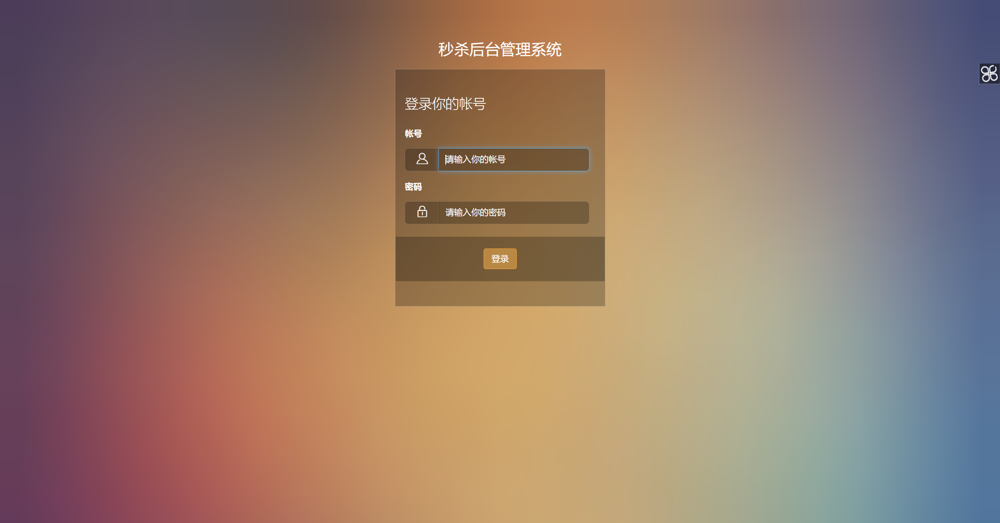

与秒杀系统相似，通过用户名和密码登录，在登录时提交post请求，后台查询数据库，对其密码进行两次md5之后的结果与数据库中存储的密码对比，如果一致则登录成功，将用户名（user）与token（两次md5）存入session中。

#### 拦截器

本系统也使用了拦截器功能，对于除了登录页面和提交登录表单的url之外的所有url都进行拦截，对session进行核验，如果session中user不为空则放行，否则回到登录界面。

#### 登录后界面

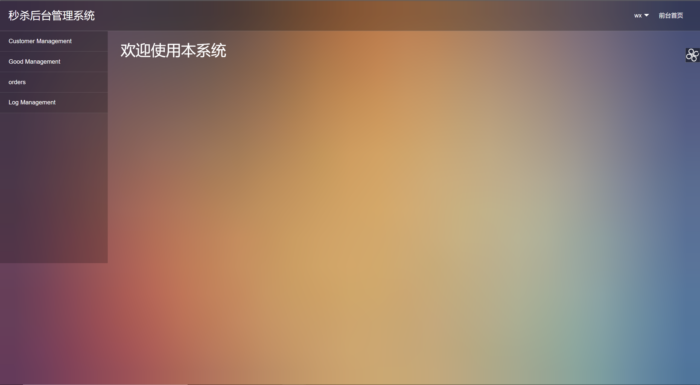

本页面左边菜单栏是根据数据库与用户等级动态生成，具有不同级别的用户将显示不同的菜单栏，具体方法是根据用户group_id查询其对应的菜单列表，对查询到的菜单列表根据菜单栏的id和parent_id生成一个菜单树，使用Thymeleaf进行渲染得到该页面。

#### 个人设置

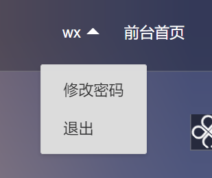

##### 修改密码

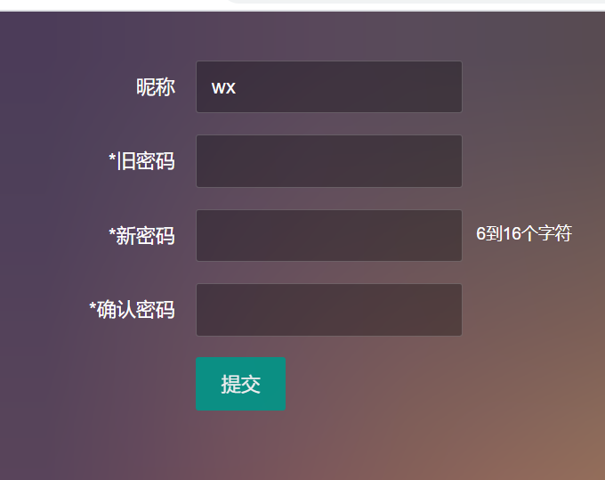

修改密码在前端核对两次输入的新密码一致，在后端验证其旧密码，如果核对通过则将数据库中的密码进行修改。

##### 退出

清除session中的信息并退出。

#### 用户管理

##### 查看用户

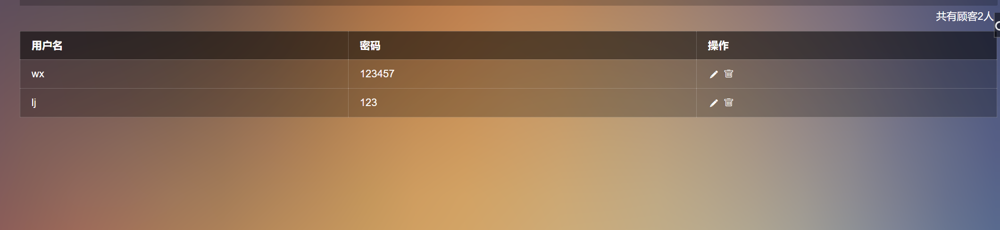

在customer list一栏可查看用户，点击之后对数据库进行查询，查询结果采用Thymeleaf进行渲染，实现用户的显示。

##### 删除用户

在查看用户界面可删除用户，删除用户即在数据库中除去该用户。

##### 编辑用户

在查看用户界面点击相应按钮，进入编辑用户界面可对用户密码进行修改，用户名则不行。

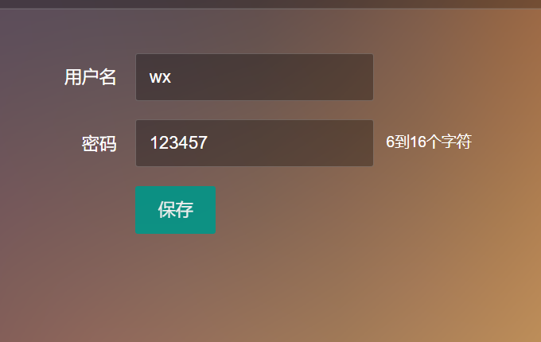

##### 添加用户


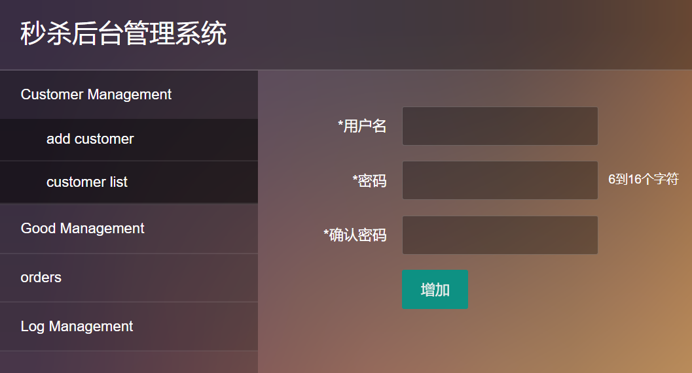

在添加用户一栏可进行用户添加，在前端使用jQuery进行判断密码符合要求（6-16个字符）后再进行提交，提交之后在数据库中进行添加。

#### 商品管理

商品管理实现与用户管理类似，有添加商品和删除商品的功能。

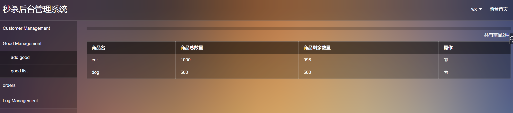

#### 订单管理

订单管理可查看订单，订单包含了商品名和用户名，点击该菜单栏时，对订单数据库进行查询，生成相应数据，采用Thymeleaf进行渲染显示在页面中。

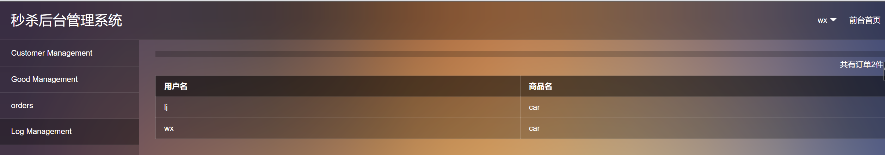

#### 日志管理

日志记录了每一次访问者访问的url和访问的时间和访问者的姓名，具体实现为在拦截器每一次拦截时对时间和访问的url和用户名进行记录。

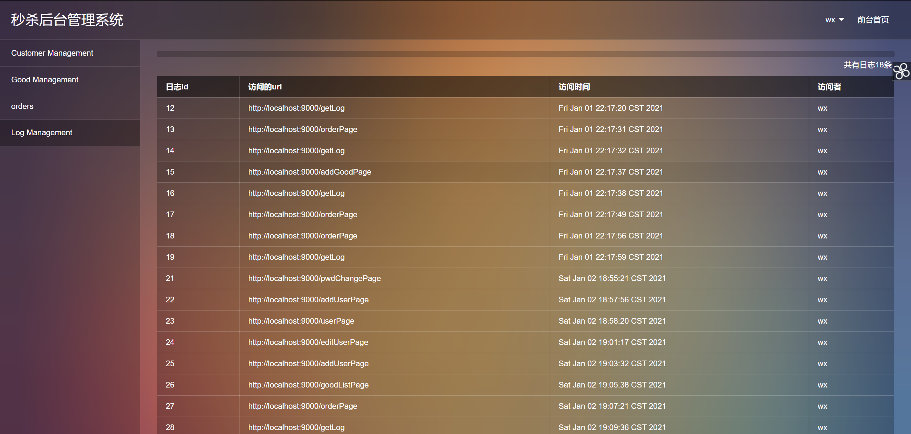

### 数据库

数据库表设计，admin为后台管理员账号，admin_group为管理员对应级别（组），customers为用户表，goods为商品列表，log为日志，menu为菜单栏，orders为订单列表。

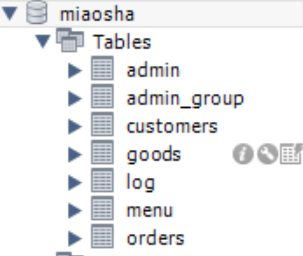

## 性能优化策略及实现

本秒杀系统采用的策略是，将请求尽量拦截在系统上游，尽量使访问数据库的流量减小，与此同时将短时间的流量进行异步、排队处理。

**异步**：在抢购时必须输入验证码，验证码正确才能成功提交订单，实现了请求的异步，减少了瞬时间的流量；

**排队**：在订单生成之后，发送给RabbitMQ，订单生成程序从RabbitMQ中获取相应订单进行处理，实现了削峰的功能；

**将流量尽量拦截在系统上游**： 将一些验证码错误的请求进行拦截，不生成相应订单；在提交订单过后，进一步将用户及商品进行记录，若再收到相同的用户和商品秒杀请求，则进行拦截；

## 应用安全策略及实现

**防止url暴露**： 商家可通过配置文件对商品秒杀开始时间和结束时间进行设置，为了防止url暴露，本系统在秒杀时间开始之前，抢购按钮是灰色的，并且此时的javascript文件中对应的url是空，只有在秒杀开始之后，对应的url才会发送给前端界面，此时按钮也变成可以使用状态，在时间截至后抢购按钮则变成灰色。

**防止SQL注入**：采用了Mybatis访问MySQL数据库，使用了其自带的防止SQL注入的功能。

**日志管理**：对用户行为进行记录，可察觉相应异常。

**密码加密**：对用户密码采用两次md5进行加密，防止了一次md5查表进行破解，也防止了明文密码在网络上传播。

